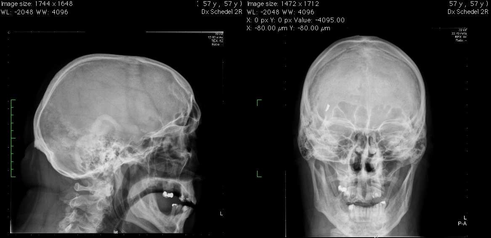

# Metaalfragment

De patiënt wordt doorgestuurd naar de MRI. Bij het neerleggen op tafel merkt
de patiënt dat er aan iets in zijn voorhoofd wordt getrokken. De patiënt wordt
meteen van tafel gehaald en er wordt een foto gemaakt.



Vraag: Wat doe je?

```

```

[Vervolg](case_part3.md)
