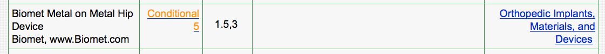

# 50 Tinten Grijs

## Heupprothese

Vraag: Stel je krijgt een patiënt met deze heupprothese. Wat doe je?

## Tatouages

Weiger je wel eens iemand met een tatouage?

## Neurostimulator

Patient (vrouw, 51 jaar, geen andere contra-indicaties) heeft een Prime
Advanced SureScan MRI neurostimulator (Medtronic 97702). De gebruikte leads
zijn: Medtronic Vectris SureScan MRI 1x8 Compact, type 977A275. Patiënt heeft
neurostimulator ter hoogte Tc8, het kastje is rechts voor in de buik
geplaatst, de electrode loopt onderhuids naar de rug. De lead is 75cm lang. 

Vraag: Zoek uit of, en zo ja onder welke condities, deze patiënt gescand kan
worden voor een MRI Brein.

