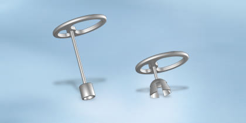

# Ketenreconstructie

## Inleiding

Aanvraag: Patient (man, 58 jaar, geen andere contra-indicaties) heeft een
operatie aan het middenoor gehad in 2006. Het verslag staat hieronder. De
aanvraag is voor een MRI Brein op 3T.


```
Pre-operatieve diagnose :
Post-operatieve diagnose :
Therapie : ketenreconstructie radicaal links.
Anaesthesie : algeheel.

Positioneren patiënt. Steriel afdekken en werken via de gehoorgang. Dr. A.
vangt aan met dr. B. Afschuiven tympanomeatale flap. Inspectie
neomiddenoor. De vorige Kursprothese 4,25 lijkt te lang. Deze is door het
trommelvlies heen gekomen. Inspectie voetplaat laat een twijfelachtige mobiele
voetplaat zien. Er wordt vanuit tragus kraakbeen twee stukjes kraakbeen in de
ovale nis geplaatst. Een stuk gelukte niet i.v.m. het fractuur van het
kraakbeenstukje.
Inspectie een kortere Kursprothese lijkt beter. Dr. C. neemt over van dr.
A. M.b.v. de pasprotheses wordt gekeken en Kurs 3,0 lijkt een betere
maat. Deze wordt geplaatst tussen de kraakbeentjes en de ovale nis.
Vervolgens wordt kraakbeen gesneden, welke op de prothese wordt geplaatst. De
prothese lijkt iets naar posterieur te kantelen. Deze wordt zover mogelijk
naar anterieur verschoven. M.b.v. gelfoam wordt de prothese iets richting
anterieur vast gezet. Vervolgens wordt het fascielapje onder het trommelvlies
geplaatst en wordt met gelfoam het trommelvlies teruggeklapt.
Plaatsen tampon. Pleister. Verband.
```

Vraag: Kan deze patiënt gescand worden en zo ja, onder welke voorwaarden?

```

```


[Vervolg](case_part2.md)
