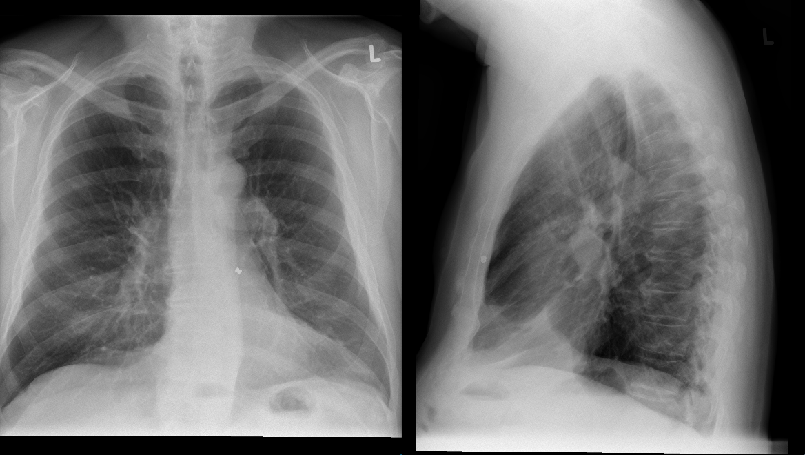

# Luchtbukskogel

## Inleiding

De vraag komt binnen uit een ander ziekenhuis of een patiënt (man, 65 jaar)
mee mag doen aan een MRI-studie. Bijzonderheid is dat deze patiënt al een
jaar of twintig een luchtbukskogeltje in zijn borst heeft als gevolg van een
broederlijk conflict.



De patiënt heeft verder geen contra-indicaties.  De artsen die verbonden zijn
aan de studie zouden deze patiënt graag willen includeren. Het gaat hierbij om
een gecombineerd onderzoek van het hoofd en het hart op een 1.5T MRI-scanner.

Vraag: Er is verder geen informatie beschikbaar over de patiënt. Wat is je advies?

```

```

[Advies](advies.md)
