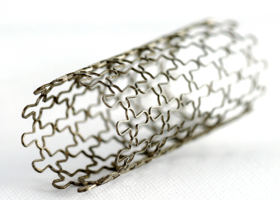
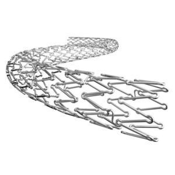
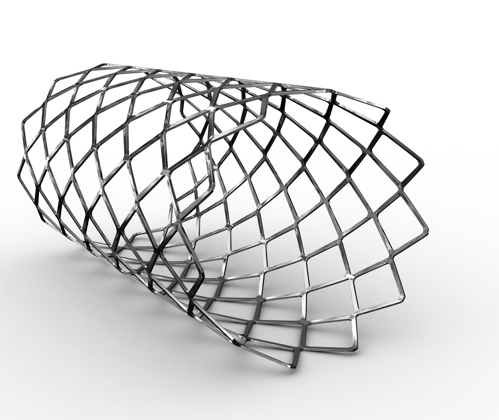

# Coronaire Stent 2

## Introductie

**Aanvraag**: MRI Brein op 3T. Patient heeft twee stents in de coronairen
beiden geplaatst in dit ziekenhuis in 2014.  Verder heeft de patient een heupprothese
die in 2010 in een ander ziekenhuis in Nederland geplaatst is.

**Vraag:** Heb je voldoende informatie om te kunnen beoordelen of de patient
gescand kan worden en onder welke voorwaarden?

[Vervolg](case_part2.md)
