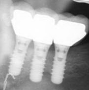

# MRI Safety Case Studies

Preliminary english version.

## Inleiding

Het doel van deze korte workshop is om aan de hand van een aantal cases een
idee te krijgen van wat er nodig is om een goed advies aan de radioloog
te kunnen geven over het wel of niet kunnen scannen van bepaalde patiënten. 
De bedoeling is dat je op zoek gaat op Internet naar informatie (bijvoorbeeld
bij [MRISafety.com](http://mrisafety.com), maar ook bij de verschillende
fabrikanten). Hierbij zul je snel merken dat dit niet altijd even eenvoudig
is. 

De cases zijn erg gevariëerd. Ze zijn samengesteld uit de vragen die wij de
afgelopen twee jaar hebben gekregen. Het is niet de bedoeling om je er in te
laten stinken, alles komt uit de praktijk. 

Het stramien is simpel, elke case begint met de aanvraag en wat extra
informatie. De bedoeling is dat je een gemotiveerd advies formuleert voor de
radioloog over het wel (en onder welke voorwaarden) of niet kunnen scannen van
de patiënt.
Er zit geen speciale volgorde in de cases, je kunt overal beginnen. Probeer
wel voordat je steeds verder gaat goed na te denken en de case uit te pluizen.

Veel plezier en succes! 

Paul de Bruin & Wouter Teeuwisse

## Cases

1. [Metaalfragment](Fragment/case.md)
1. [Coronaire Stent 1](Stent1/case.md)
1. [Coronaire Stent 2](Stent2/case.md)
1. [Luchtbukskogel](Kogel/case.md)
1. [Neurovasculaire clip](Clip/case.md)
1. [Fixateur Externe](FixateurExterne/case.md)
1. [Ketenreconstructie](Ketenreconstructie/case.md)
1. [Gezonde vrijwilliger 1](Volunteer1/case.md)
1. [Cochleair implantaat](CochleairImplantaat/case.md)
1. [Grijze categorie](Grijs/case.md)

## Colofon

* Commentaar is welkom
* Deze case studies zijn uitgewerkt onder het beleid dat in het LUMC gevoerd
  wordt. Echter, deze uitwerkingen zijn alleen als voorbeeld en niet als richtlijn
  bedoeld.  
