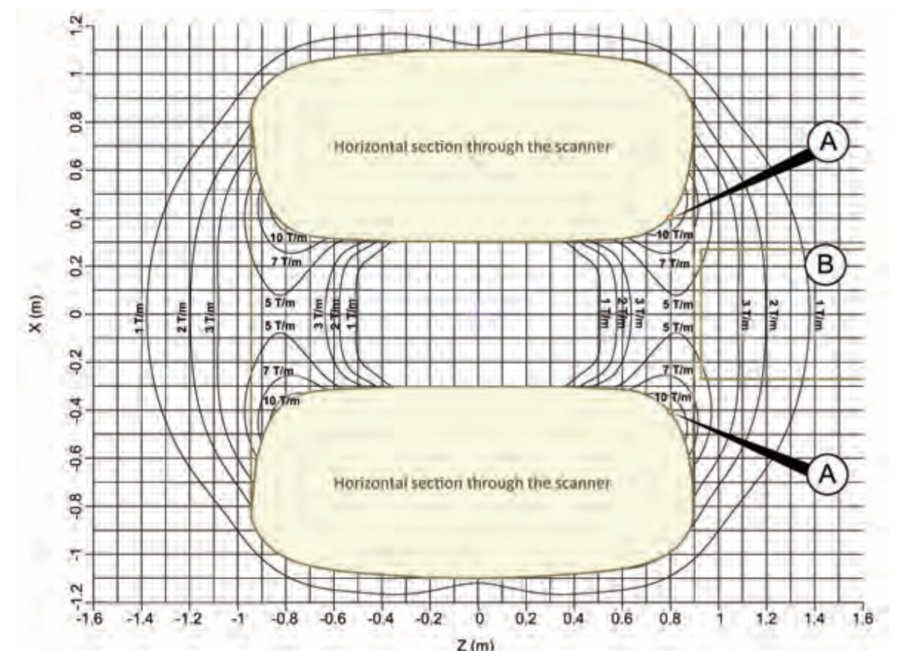
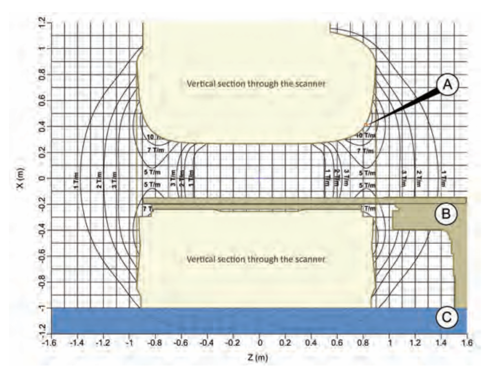

# Technische achtergrond

## Veldsterktes

Een overzicht van de verschillende gyromagnetische ratio's kun je
[hier](https://en.wikipedia.org/wiki/Gyromagnetic_ratio) vinden. Voor protonen
geldt dat de gyromagnetische ratio gelijk is aan 42.576 MHz/T. Hiermee komt
een 1.5T scanner op ongeveer 64MHz uit en een 3T scanner op 128MHz.

## Golflengtes

| Type of wave     | Typical frequency [Hz]  | Typical wavelength |
|------------------|-------------------------|--------------------|
| Radio            | \\(~10^8\\) (100 MHz)   | ~3 m               |
| Microwave        | \\(~10^{10}\\) (10 GHz) | ~3 cm              |
| Infrared         | \\(~3 \times 10^{13}\\) | ~10 \\(\mu\\)m     |
| Ultraviolet      | \\(~3 \times 10^{16}\\) | ~10 nm             |
| X-ray            | \\(~3 \times 10^{18}\\) | ~0.1 nm            |
| \\(\gamma\\)-ray | \\(~3 \times 10^{20}\\) | ~1 pm              |

Maximale excitatie gebeurt op \\(\lambda/2\\).  In weefsel is de golflengte
korter vanwege de dielectrische effecten. Op bijvoorbeelde de [Tissue property
calculator](http://niremf.ifac.cnr.it/tissprop/htmlclie/htmlclie.php) kun je
een idee krijgen wat de golflengte bij verschillende veldsterktes is in
weefsels.

## SAR

SAR staat voor Specific Absorption Rate en geeft een indicatie van mogelijke
opwarming van de persoon in de scanner. SAR wordt uitgedrukt in W/kg. 

Volgens IEC60601-2-33 ed. 3 (2015-06) is de SAR gelimiteerd als volgt:

| Averaging time          | 6 minutes      |
|-------------------------|----------------|------------------|----------|
| Body region             | Whole body SAR | Partial body SAR | Head SAR |
| Operating mode          | (W/kg)         | (W/kg)           | (W/kg)   |
| NORMAL                  | 2              | 2-10             | 3.2      |
| FIRST LEVEL CONTROLLED  | 4              | 4-10             | 3.2      |
| SECOND LEVEL CONTROLLED | >4             | >(4-10)          | >3.2     |

## Temperatuurlimieten

Volgens IEC60601-2-33 ed. 3 (2015-06) moet MRI-apparatuur de opwarming van de patiënt beperken tot de volgende waarden:

| Operating mode          | Maximum CORE TEMPERATURE  | Maximum Local tissue temperature  | Rise of CORE TEMPERATURE °C |
| ----------------------- | ------------------------- | --------------------------------- | ------------------------    |
| NORMAL                  | 39                        | 39                                | 0.5                         |
| FIRST LEVEL CONTROLLED  | 40                        | 40                                | 1                           |
| SECOND LEVEL CONTROLLED | >40                       | >40                               | >1                          |

## Spatiële gradient

In de eisen aan een implantaat wordt vaak ook een maximale spatiële gradient
genoemd. Het gaat hier dan *niet* om het schakelen van de gradiënten van de
scanner maar om het verloop van het \\( B_0 \\)-veld in de ruimte. Van elke scanner is
een plot beschikbaar met het verloop van dit veld. De kracht die op een implantaat werkt
is ruwweg proportioneel met \\( B_0 \times \Delta B_0 \\). De spatiële gradient
wordt uitgedrukt in de eenheid T/m, maar Gauss/cm wordt ook wel gebruikt. Voor het
omrekenen geldt dat 1 T/m gelijk is aan 100 G/cm.

 
  
Horizontaal en verticaal aanzicht van het spatiële gradientveld van een Philips MRI-scanner.

