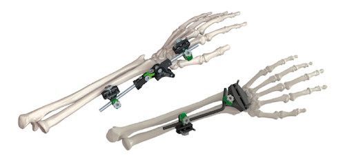
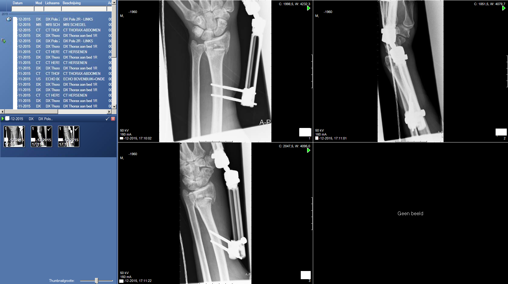

# Fixateur Externe 


## Inleiding

Voor complexe fracturen van de pols kan een zogenaamde *fixateur externe*
worden gebruikt. Rechts staat een voorbeeld van een dergelijke fixateur van de
fabrikant [Orthofix](http://www.orthofix.com).


**Aanvraag:** Patiënt is een man (55 jaar) die ruim een maand geleden van een
ladder is gevallen.  Binnengebracht met de ambulance. Nu wordt gevraagd een
MRI Brein, inclusief FLAIR, DWI en een susceptibility gewogen sequentie. 

Extra informatie:




Vraag: Zoek uit of, en zo ja onder welke condities, deze patiënt gescand zou kunnnen worden.

```

```

[Vervolg](case_part2.md)
