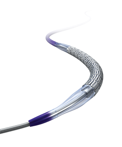

# Coronaire Stent 1

## Extra informatie


Bij het uitzoeken blijkt het niet om een coronaire stent te gaan maar om een
vasculaire stent. Informatie kan soms schaars zijn. Misschien is het verkeerd
doorgegeven.

Tip: Overleg met je collega's voor je verder gaat.

**Vraag:** Heb je nu wel voldoende informatie om te kunnen beoordelen of de
patiënt gescand kan worden en onder welke voorwaarden? Heb je nog beperkingen kunnen vinden?


```

```

[Vervolg](case_part3.md)
